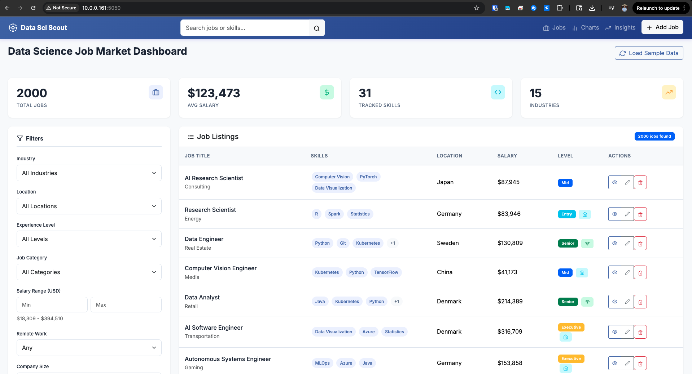
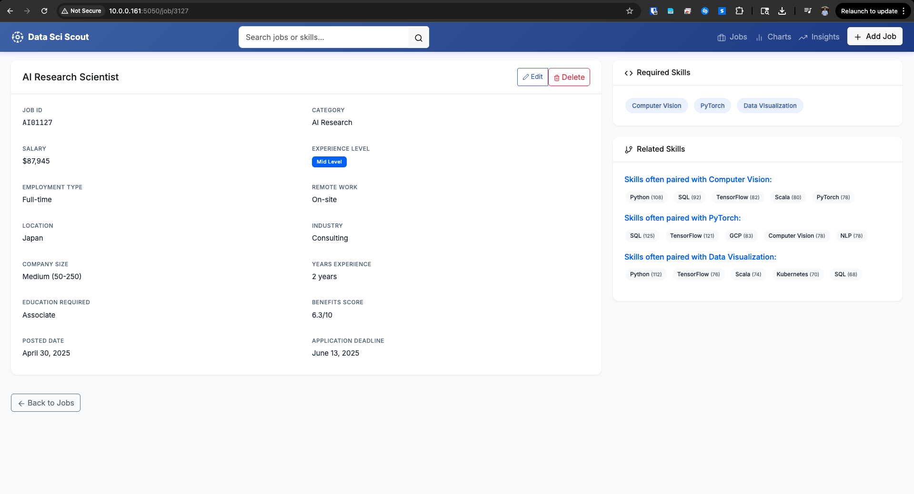
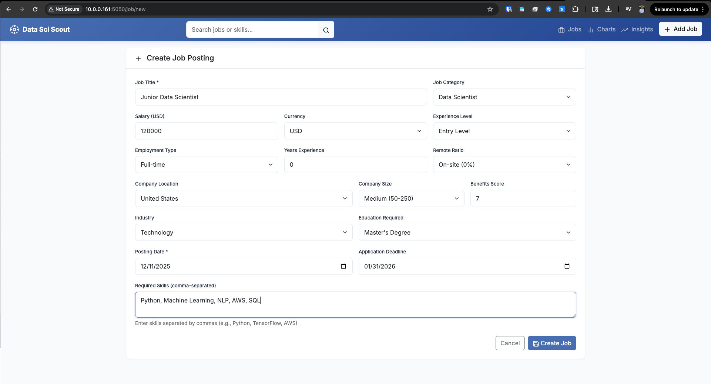
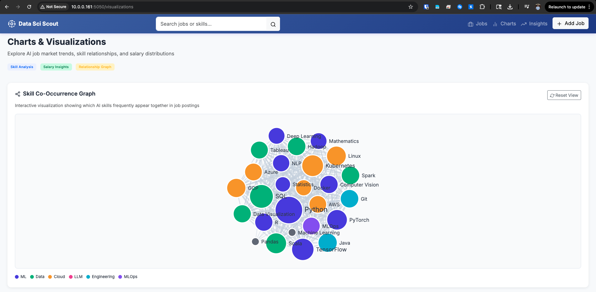
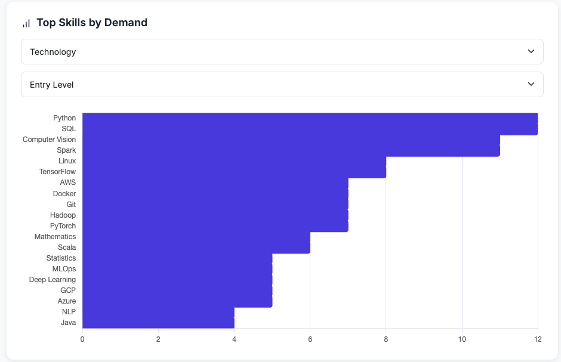
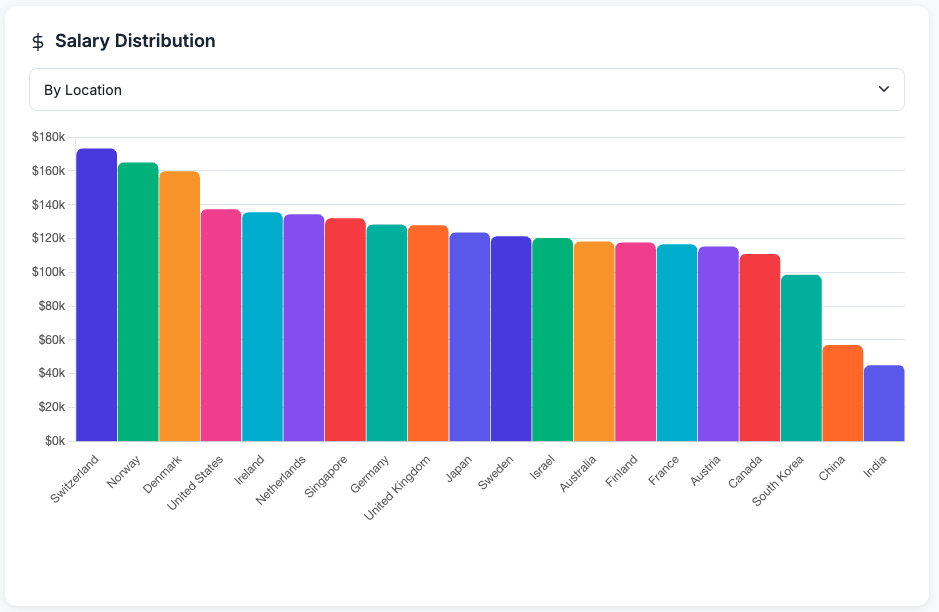
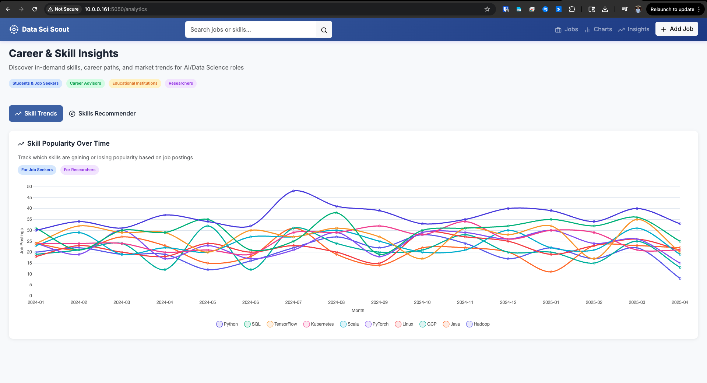
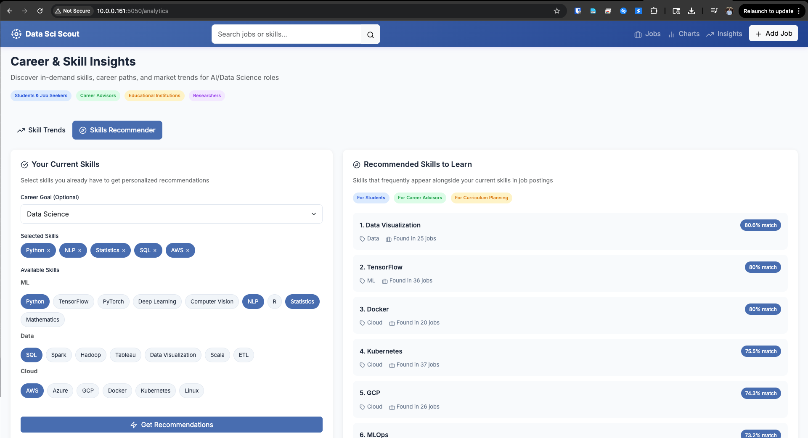

# Data Sci Scout - Project Documentation

## Overview
A web application that analyzes and visualizes the AI and Data Science job market. Combines a relational database (PostgreSQL) for structured job postings with an in-memory graph database (fallback when Neo4j is not configured) for modeling skill relationships.



## Tech Stack
- **Backend**: Flask (Python)
- **Database**: PostgreSQL with SQLAlchemy ORM
- **Graph Database**: Neo4j (optional) or In-Memory Skill Graph (default)
- **Frontend**: Vanilla JavaScript, D3.js for graph visualization, Chart.js for charts
- **Styling**: Bootstrap 5, Custom CSS

## Project Structure
```
├── app.py              # Flask app initialization and database setup
├── main.py             # Application entry point
├── models.py           # SQLAlchemy models (Job, Skill)
├── routes.py           # All Flask routes and API endpoints
├── neo4j_service.py    # Neo4j/in-memory graph service
├── sample_data.py      # Sample data generation
├── templates/          # Jinja2 HTML templates
│   ├── base.html       # Base template with navigation
│   ├── index.html      # Main dashboard with job listings
│   ├── visualizations.html  # Analytics dashboard
│   ├── job_form.html   # Create/Edit job form
│   └── job_detail.html # Single job view
├── static/
│   ├── css/style.css   # Custom styles
│   └── js/visualizations.js  # D3.js and Chart.js visualizations
└── design_guidelines.md # UI/UX design specifications
```

## Features
1. **Job Listings Dashboard** - View, search, filter jobs by industry, location, experience level
2. **Full CRUD Operations** - Create, Read, Update, Delete job postings
3. **Skill Co-Occurrence Graph** - Interactive D3.js force-directed graph showing skill relationships
4. **Skill Frequency Chart** - Bar chart of most in-demand skills with filters
5. **Salary Distribution** - Visualization of salaries by location or job category
6. **Sample Data Generator** - Load 100 realistic AI job postings with one click

## API Endpoints
- `GET /` - Main dashboard with job listings
- `GET /visualizations` - Analytics dashboard
- `GET/POST /job/new` - Create new job
- `GET/POST /job/<id>/edit` - Edit existing job
- `POST /job/<id>/delete` - Delete job
- `GET /job/<id>` - View job details
- `GET /api/skill-graph` - Get skill graph data (nodes + links)
- `GET /api/skill-frequency` - Get skill frequency data
- `GET /api/salary-distribution` - Get salary distribution data
- `POST /init-data` - Initialize sample data

## Environment Variables
- `DATABASE_URL` - PostgreSQL connection string (required)
- `SESSION_SECRET` - Flask session secret key (required)
- `NEO4J_URI` - Neo4j connection URI (optional)
- `NEO4J_USER` - Neo4j username (optional)
- `NEO4J_PASSWORD` - Neo4j password (optional)

## Running the Application
The application runs on port 5050 using gunicorn:
```bash
gunicorn --bind 0.0.0.0:5050 --reuse-port --reload main:app
```
## Example Images

### 1. Dashboard


### 2. Job Details Page


### 3. Create a Job Page


### 4. Skill Co-occurrence Graph


### 5. Skills Frequency Chart


### 6. Salary Distribution Chart 


### 7. Skills Trend Chart


### 8. Skills Recommender Page

